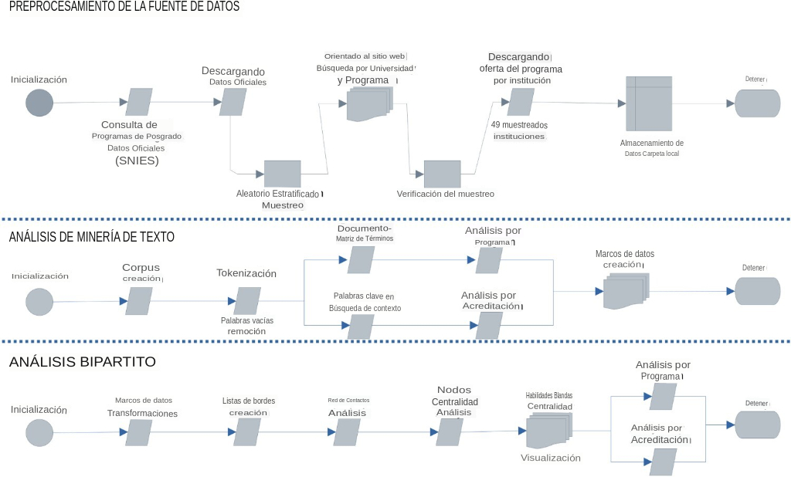

# Primer Caso

Nuestro primer caso es de interés estratégico para rectores y autoridades universitarias que buscan responder a la siguiente pregunta de interés estratégico:

**¿Cuáles son las habilidades blandas más importantes en la oferta de postgrado de las universidades Colombianas?**

Para responder esa pregunta, uno podría pensar la relación entre la oferta de postgrado (Graduate Programs) y la formación de habilidades blandas (Soft Skills) de la siguiente manera.

```{r f1, echo=FALSE, out.width = '100%', fig.show='hold', fig.cap='Una representación visual de la relación entre habilidades blandas y ofertas de postgrado', }
knitr::include_graphics("F1.png")
```


## Contexto del Proyecto

En Colombia, las universidades publican en sus páginas web la oferta académica de cursos de especialización, maestría y doctorado. Esta oferta académica es información (principalmente de texto) que se dirige a los estudiantes interesados en estudiar un postgrado.

¿Puede el estudiante saber cómo un postgrado le va a ayudar a formar sus habilidades blandas de "creatividad", "solucionar problemas", o tener un "pensamiento crítico"? 

García-Chitiva y Correa [-@Garciachitiva2023] abordaron esta pregunta usando el enfoque de Gestión de Proyectos de Alta Complejidad. Veamos en las siguientes líneas cómo se aplica este enfoque. 

Para empezar el proyecto, los investigadores se apoyaron en una metodología llamada *Redes Bipartitas* que se vincula con un área de las matemáticas llamada *Teoría de Grafos* 
<iframe width="100%" height="400" src="https://www.youtube.com/embed/lp-1rvtRYQg" frameborder="0" allow="autoplay; encrypted-media" allowfullscreen></iframe>

Aplicando las nociones explicadas en el video anterior, podemos concebir la relación entre habilidades blandas y programas de postgrado como lo reflejado en la Figura \@ref(fig:f1). En esta red bipartita, uno está interesado en comprender cómo se conectan las habilidades blandas interpersonales sugeridas por Scheerens, van der Werf y de Boer [-@Scheerens2020] con los programas de postgrado ofrecidos en Colombia. La conexión entre estos dos conjuntos se basa en cada vínculo representado como líneas grises rectas. En cada conjunto, cada entidad se conoce formalmente como nodo, y la adyacencia del nodo se refiere a su conexión con otro nodo (es decir, una línea gris recta). La Figura \@ref(fig:f1) muestra que el número de conexiones varía para cada nodo en ambos conjuntos. Lo más importante es que no es necesario que la conexión entre estos dos conjuntos sea completa para afirmar que la capacitación en habilidades interpersonales está presente en un programa de posgrado. En otras palabras, el número de conexiones que cada habilidad blanda de la izquierda tiene con cada programa de posgrado de la derecha puede variar desde cero hasta su máximo, que es el total de programas de posgrado muestreados. Expliquemos. En la Figura \@ref(fig:f1), el pensamiento crítico es la habilidad blanda más conectada, ya que se conecta con cuatro programas (es decir, Doctorado en Física de Altas Energías, Maestría en Ciencia de Datos, Doctorado en Gestión de Residuos y Maestría en Administración de Empresas). La curiosidad es la menos conectada ya que solo tiene una conexión con un programa (es decir, Doctorado en Física de Altas Energías). En la Figura \@ref(fig:f1), la creatividad, la negociación y la empatía tienen el mismo número de conexiones, pero se conectan de manera diferente (por ejemplo, la negociación se conecta con la administración de empresas y la especialización en recursos humanos, mientras que la empatía se conecta con la odontología maxilofacial y los recursos humanos, y la creatividad está ligada con la ciencia de datos y la gestión de residuos). Así, en el análisis de redes bipartitas, el número de conexiones y quién se conecta con quién son el centro del estudio. Sin embargo, el trabajo de García-Chitiva y Correa [-@Garciachitiva2023] no se centra en el mero reconteo porque dicho recuento se plantea como un sistema en el que la centralidad de un nodo es relativa a la centralidad de otros nodos de la red. El sistema bajo escrutinio es entonces la información textual disponible en cada programa de posgrado de la muestra, tratado como un corpus que representa la comprensión institucional de los perfiles profesionales de los graduados. Además, el enfoque de red bipartita nos permite estimar la conectividad de cada programa. Así, el doctorado en física de altas energías y la maestría en ciencia de datos comparten el mismo número de conexiones (cada uno con tres enlaces), mientras que el resto de programas comparten el mismo número de conexiones (cada uno con dos enlaces).

### Etapa 1: Concepctualización de los datos del proyecto

Para responder a la pregunta del proyecto, necesitamos encontrar unos datos que puedan ser analizables desde el punto de vista de la red bipartita y con ella examinar las conexiones directas entre los nodos de un conjunto a la vez (es decir, habilidades blandas y estudios de posgrado). Para hacer esto, se pueden extraer y visualizar las proyecciones unipartitas de la red bipartita original, de la siguiente manera.

Primero, se cargan los datos que deben usarse para construir la red. Esto se hace a través de los siguientes códigos.
```{r, echo=TRUE, include=TRUE, message=FALSE}
library(readr)
Data_Figure2 <- read_csv("Data/Data_Figure2.csv")
```

```{r, echo=FALSE, include=TRUE, message=FALSE}
library(knitr)
library(broom)
library(kableExtra)
setwd("Data")
data <- readr::read_csv("Data_Figure2.csv")
html_table <- kable(data, format = "html")%>%
  kable_styling()

# Print the HTML table
html_table
```


Luego, se usan los datos "Data_Figure2" como insumo para la red, haciendo uso de la librería [igraph](https://igraph.org/).

```{r, echo=TRUE, include=TRUE, message=FALSE, warning=FALSE}
library(igraph)
Network <- Data_Figure2
bn2 <- graph.data.frame(Network,directed=FALSE)
V(bn2)$type <- bipartite_mapping(bn2)$type
V(bn2)$color <- ifelse(V(bn2)$type, "green", "red")
V(bn2)$shape <- ifelse(V(bn2)$type, "square", "circle")
V(bn2)$label.cex <- ifelse(V(bn2)$type, 0.5, 1)
V(bn2)$size <- sqrt(igraph::degree(bn2))
E(bn2)$color <- "lightgrey"

bn2.pr <- bipartite.projection(bn2)
Programs <- bn2.pr$proj2
Skills <- bn2.pr$proj1


plot(Skills, vertex.label.color = "black", 
     vertex.label.cex = 1.5, 
     vertex.color = "lightgreen", 
     vertex.size = 60, 
     edge.width = 3.5, 
     edge.color = "gray30", 
     layout = layout_components, main = "")

plot(Programs, vertex.label.color = "black", 
     vertex.label.cex = 1.2, 
     vertex.color = "pink", 
     vertex.size = 40, 
     edge.width = 5, 
     edge.color = "gray30", 
     layout = layout_components, 
     main = "")

```


Lo divertido de este trabajo fue la manera cómo García-Chitiva y Correa [-@Garciachitiva2023] encontraron una manera de recolectar la información necesaria para armar una tabla como la anterior pero reflejando la realidad de la oferta académica presentada por 49 universidades colombianas que en total ofrecían 230 programas de postgrado, incluyendo especializaciones, maestrías y doctorados. 


### Etapa 2: Recolección de los datos reales del proyecto

Para la recolección de los datos se siguió un procedimiento de muestreo aleatorio estratificado considerando las características del sistema de información nacional de educación superior (SNIES) de Colombia. La Figura \@ref(fig:f3) muestra la distribución muestral de programas de postgrado analizados para el proyecto. 

```{r f3, echo=FALSE, out.width = '100%', fig.show='hold', fig.cap='Total de ofertas de postgrado muestreadas para el proyecto', }
knitr::include_graphics("F3.jpg")
```


La Figura \@ref(fig:f2) muestra un flujograma de tres procesos interrelacionados para analizar y preprocesar los datos recolectados (parte superior), analizar el texto de la oferta académica de postgrado con técnicas de minería de textos (parte intermedia) y con la red bipartita entre programas y habilidades blandas (parte inferior).

```{r f2, echo=FALSE, out.width = '100%', fig.show='hold', fig.cap='Flujograma del proceso de recolección de datos asociados a la importancia de las habilidades blandas para la oferta de postgrado en Colombia', }

```

### Etapa 3: Análisis de los Datos

Para el análisis de los datos, el proyecto empleó la librería "quanteda". Con esta librería, el analista puede hacer minería de textos. Dicho de otra manera, se pueden tratar a los textos "como si fuesen datos" y a partir del conteo de sílabas, palabras, oraciones y párrafos, se les puede representar en un espacio vectorial y con ello analizar de manera cuantitativa su "representación vectorial".


Esta "representación vectorial" empieza por definir de manera explícita cuáles son las habilidades blandas que queremos incluir en nuestros análisis. Luego, a cada habilidad blanda la identificamos con una etiqueta de la siguiente manera:

```{r}
load("Data/DataForFigure4.RData")
rm(list=setdiff(ls(), "TODAS"))
TODAS$keyword <- tolower(TODAS$keyword)
TODAS$keyword[TODAS$keyword=="acercar"] <- "S1"
TODAS$keyword[TODAS$keyword=="analizar"] <- "S2"
TODAS$keyword[TODAS$keyword=="argumentar"] <- "S3"
TODAS$keyword[TODAS$keyword=="ayudar"] <- "S4"
TODAS$keyword[TODAS$keyword=="cambiar"] <- "S5"
TODAS$keyword[TODAS$keyword=="compartir"] <- "S6"
TODAS$keyword[TODAS$keyword=="competir"] <- "S7"
TODAS$keyword[TODAS$keyword=="comprender"] <- "S8"
TODAS$keyword[TODAS$keyword=="comprometerse"] <- "S9"
TODAS$keyword[TODAS$keyword=="comunicar"] <- "S10"
TODAS$keyword[TODAS$keyword=="conflictos"] <- "S11"
TODAS$keyword[TODAS$keyword=="controlar"] <- "S12"
TODAS$keyword[TODAS$keyword=="crear"] <- "S13"
TODAS$keyword[TODAS$keyword=="creatividad"] <- "S14"
TODAS$keyword[TODAS$keyword=="decidir"] <- "S15"
TODAS$keyword[TODAS$keyword=="dirigir"] <- "S16"
TODAS$keyword[TODAS$keyword=="empatía"] <- "S17"
TODAS$keyword[TODAS$keyword=="equipos"] <- "S18"
TODAS$keyword[TODAS$keyword=="ético"] <- "S19"
TODAS$keyword[TODAS$keyword=="evaluar"] <- "S20"
TODAS$keyword[TODAS$keyword=="flexibilidad"] <- "S21"
TODAS$keyword[TODAS$keyword=="fomentar"] <- "S22"
TODAS$keyword[TODAS$keyword=="fortalecer"] <- "S23"
TODAS$keyword[TODAS$keyword=="generar"] <- "S24"
TODAS$keyword[TODAS$keyword=="gestionar"] <- "S25"
TODAS$keyword[TODAS$keyword=="identificar"] <- "S26"
TODAS$keyword[TODAS$keyword=="impulsar"] <- "S27"
TODAS$keyword[TODAS$keyword=="innovar"] <- "S28"
TODAS$keyword[TODAS$keyword=="interactuar"] <- "S29"
TODAS$keyword[TODAS$keyword=="liderar"] <- "S30"
TODAS$keyword[TODAS$keyword=="manifestar"] <- "S31"
TODAS$keyword[TODAS$keyword=="motivar"] <- "S32"
TODAS$keyword[TODAS$keyword=="orientar"] <- "S33" 
TODAS$keyword[TODAS$keyword=="pensamiento crítico"] <- "S34"
TODAS$keyword[TODAS$keyword=="persuasión"] <- "S35"
TODAS$keyword[TODAS$keyword=="planificar"] <- "S36"
TODAS$keyword[TODAS$keyword=="reconocer"] <- "S37"
TODAS$keyword[TODAS$keyword=="reflexionar"] <- "S38"
TODAS$keyword[TODAS$keyword=="resolver"] <- "S39"
TODAS$keyword[TODAS$keyword=="respetar"] <- "S40"
TODAS$keyword[TODAS$keyword=="responsable"] <- "S41"
TODAS$keyword[TODAS$keyword=="solucionar problemas"] <- "S42"
TODAS$keyword[TODAS$keyword=="tomar decisiones"] <- "S43"
```

Así pues, la habilidad de "acercar" es etiquetada con "S1", la habilidad de "analizar" es etiquetada con "S2" y así siguiendo como se observa en la lista anterior. Con ello, procedemos a dibujar la proyección unipartita de la red bipartita entre habilidades blandas y programas, de la siguiente manera.

```{r, echo=TRUE, include=TRUE, message=FALSE, warning=FALSE}
Network <- TODAS[c(1,5)]
Network <- Network[!duplicated(Network[c(1,2)]),]


library(igraph)
bn2 <- graph.data.frame(Network,directed=FALSE)
V(bn2)$type <- bipartite_mapping(bn2)$type
V(bn2)$color <- ifelse(V(bn2)$type, "red", "green")
V(bn2)$shape <- ifelse(V(bn2)$type, "circle", "square")
V(bn2)$label.cex <- ifelse(V(bn2)$type, 0.5, 1)
V(bn2)$size <- sqrt(igraph::degree(bn2))
E(bn2)$color <- "lightgrey"

bn2.pr <- bipartite.projection(bn2)
Terms <- bn2.pr$proj2

centrality_scores <- degree(Terms)

# Normalize the centrality scores to a range between 0 and 1
normalized_scores <- (centrality_scores - min(centrality_scores)) / (max(centrality_scores) - min(centrality_scores))

# Create a color palette with different colors
color_palette <- colorRampPalette(c("red", 
                                    "pink", 
                                    "lightgreen", 
                                    "green"))(length(unique(normalized_scores)))

# Assign colors to nodes based on their normalized centrality scores
node_colors <- color_palette[rank(normalized_scores)]

# Plot the network with node colors based on centrality
plot(Terms, 
     vertex.label.color = "black", 
     vertex.label.cex = 0.8, 
     vertex.color = node_colors, 
     vertex.size = 15, 
     edge.width = 0.5, 
     edge.color = "lightgray", 
     layout = layout_components, 
     main = "")
```

Los nodos en rojo representan las habilidades blandas menos importantes, mientras que los nodos en verde representan las habilidades blandas más importantes. Los nodos blancos están en una "posición intermedia" de importancia entre los rojos y los verdes. 

### Etapa 4: Respuesta a las preguntas de Investigación

En el trabajo de García-Chitiva y Correa [-@Garciachitiva2023] se establecieron las siguientes preguntas de investigación:

- ¿Podemos estimar la relación entre las habilidades blandas como habilidades socioemocionales y la oferta de programas de posgrado? Y de ser así,

- ¿Podemos identificar qué habilidades interpersonales tienden a ser más centrales en una muestra de programas de posgrado? Y de ser así,

- ¿Estas habilidades sociales están igualmente vinculadas a todos los estándares de acreditación y tipos de programas, o se conectan de manera diferente en función de la acreditación o el tipo de programa?

La respuesta a la primera pregunta es visible a través de la proyección unipartita de la red que muestra las conexiones entre nodos rojos, blancos y verdes anteriormente. Y para complementar esa respuesta, podemos presentar visualmente cómo se correlacionan las diferentes medidas de centralidad de estas competencias, de la siguiente manera:

```{r}
load("Data/DataForFigure4B.RData")
rm(list=setdiff(ls(), "Gen"))
Gen <- Gen[1:4]

library(psych)
pairs.panels(Gen, 
             method = "spearman", 
             hist.col = "green",
             density = TRUE,  
             ellipses = TRUE,
             pch = 10,
             cex = 1,
             cex.axis = 1.8,
             cex.labels = 1.5,
             lwd = 1,
             rug = TRUE,
             stars = TRUE
)
```

Es bastante evidente a partir de la Figura anterior que las cuatro medidas de centralidad correlacionan bastante bien entre sí (revelando un aspecto deseable en la medición de la importancia de las habilidades blandas). Ahora podemos llegar a mostrar cuál sería las diez habilidades blandas más imortantes según los datos recolectados. 

```{r, echo=TRUE, include=TRUE, message=FALSE, warning=FALSE, fig.height=8, fig.width=15}
load("Data/DataforResultingBipartiteNetwork.RData")
rm(list=setdiff(ls(), "DTM3"))
DTM4 <- apply(DTM3, 1, function(row) any(row != 0))
BN <- DTM3[DTM4, ]

library(bipartite)
plotweb(BN, method = "normal",
        text.rot = 0,
        col.high = "lightgreen", 
        bor.col.high = "lightgreen",
        col.low = "pink", 
        bor.col.low = "pink",
        col.interaction = "grey90",
        bor.col.interaction = "grey90",
        low.lablength = 0,
        labsize = 2)
```

