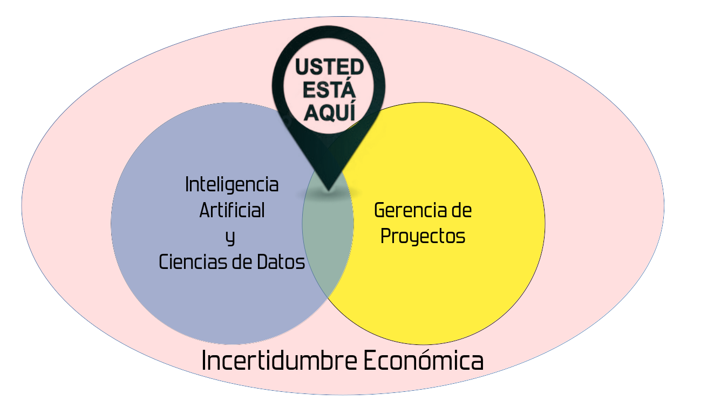

# Sobre el autor {-}
Juan C. Correa es venezolano, está casado y tiene un hijo. Es egresado de la Universidad Católica Andrés Bello como licenciado en psicología y magíster en metodología de las ciencias del comportamiento, y es doctor en ciencias de la Universidad Simón Bolívar de Venezuela. Su estancia postdoctoral fue en la Universidad de Economía y Negocios de Praga, en República Checa. Su experiencia docente se concentra en varias universidades de Colombia (en la Fundación Universitaria Konrad Lorenz, el Colegio de Estudios Superiores de Administración, Escuela Colombiana de Ingeniería Julio Garavito, Universidad del Rosario, Universidad de La Sabana) y Venezuela (en la Universidad Católica Andrés Bello, la Universidad Simón Bolívar, la Universidad Nacional Experimental Antonio José de Sucre). Ha sido invitado como conferencista en la Universidad de Economia y Negocios de Praga (República Checa), Universidad de Hamburgo (Alemania), Universidad de Granada (España), Universidad de Worcester (UK), Universidad de Norfolk (USA), Universidad Nacional de Colombia, Universidad Espíritu Santo (Ecuador), en la Sociedad Peruana de Psicometría (Perú), Universidad de las Américas (Chile), Universidad Quintana Roo, Universidad de Monterrey y Tecnológico de Monterrey (México), en el Colegio Raisoni de Ingeniería y el instituto tecnológico de Maharashtra, Universidad Mundial de la Paz (India). Ha participado y obtenido recursos financieros para la investigación en Venezuela, Colombia, República Checa e India. Su experiencia como consultor organizacional para empresas de varios sectores la ha combinado con una agenda de investigación que refleja sus intereses hacia el área de sistemas complejos, la ciencia abierta, la ciencia de datos conductuales y la analítica de datos para los negocios. Ha sido invitado como par-evaluador de cientos de artículos recibidos en decenas de revistas científicas indexadas en Web of Science o Scopus y en 2022 fue invitado como par-evaluador de proyectos de investigación y desarrollo para el área de economía y negocios organizada por la Fundación para la Ciencia y Tecnología del gobierno de Portugal. En 2023 fundó Critical Centrality Institute, una iniciativa concebida como tanque de pensamiento para ofrecer evidencia empírica sobre temas críticos de nuestra sociedad.

# Prefacio {-}

La historia de la inteligencia artificial [@Russell2021] y la del desarrollo de productos tecnológicos [@Ruhe2014] son dos historias aparentemente independientes que en realidad comparten muchos elementos que las conectan entre sí. 

Estas dos historias se entrecruzan con los desarrollos industriales de empresas como Canon, Xerox, Honda, American Airlines, o Hewlett-Packard (que entre la década de 1970 y 1980 eran como las empresas de base tecnológica como hoy lo es Google, Meta, Apple, o Amazon). Estas empresas fueron y siguen siendo miembros del consorcio empresarial conocido como **Object Management Group** (OMG). Este consorcio fundado en 1989, se dedica a velar por el cuidado y el establecimiento de normas y estándares para el desarrollo de tecnologías orientadas a objetos, tales como el lenguaje unificado de modelo (UML o "Unified Model Language"), el lenguaje para el intercambio de metadatos (XMI "Extensible Markup Language Interchange"), la arquitectura intermediaria de solicitud de objetos comunes (CORBA o "Common Object Request Broker Architecture") o el Modelo y Notación para Procesos de Negocio (BPMN o "Business Process Model and Notation").

En un artículo publicado por la prestigiosa revista _Harvard Business Review_, Takeuchi y Nonaka [-@Takeuchi1986] introdujeron el término **SCRUM** para hacer referencia a un nuevo enfoque que permitía aumentar la velocidad y la flexibilidad en el desarrollo de productos comerciales. A este enfoque lo asociaron con el deporte del rugby, en el que un único equipo se enfrenta a otro para aventajarle al recorrer distancias cortas pero entrelazadas, pasándose el balón de un lado a otro hasta llegar a la meta y anotar un tanto. 

No fue sino hasta 1997 que @Schwaber1997 publicó un artículo seminal sobre el proceso de desarrollo SCRUM como un capítulo del libro editado por @Sutherland1997 sobre los sistemas, lenguajes y aplicaciones de la <u>**programación orientada a objetos**</u>. La programación orientada a objetos es un paradigma de la programación computacional (diferente a otros paradigmas como el estructurado, el funcional, o el lógico) que se basa en el concepto de "objetos" como entidades que contienen datos (llamados atributos) y comportamiento (llamados métodos), que se utilizan para representar, modelar, y analizar cualitativa y cuantitativamente entidades del mundo real.

La idea de **Industria 4.0** (cuarta revolución industrial) emerge como el resultado de las diferentes aplicaciones de la progrmación orientada a objetos. Para entender el alcance de la programación orientada a objetos, basta con mencionar algunas de sus herramientas emparentadas:

- Diseño, programación y control en robótica y sistemas robóticos para procesos de manufactura [@Bison1989]

- Plataformas para el modelado y la simulación basada en agentes inteligentes [@Wooldridge1995].

- Sistemas distribuidos con estándares CORBA (i.e., "Common Object Request Broker Architecture") [@Sutherland1997].

- Sistemas para el Control Supervisorio y Adquisicón de Datos (SCADA o "Supervisory Control and Data Acquisition")

- Computación Gráfica para la visualización de datos estadísticos [@Wilkinson2012].

La relación entre CORBA y SCADA puede ayudar a entender como se vinculan estas tecnologías con propósitos y aplicaciones diferentes. CORBA es una arquitectura y un conjunto de estándares que permiten que diversos componentes de software escritos en múltiples lenguajes de programación y que funcionan en diferentes computadoras, puedan trabajar juntos. Los estándares CORBA facilitan el desarrollo de aplicaciones distribuidas en entornos heterogéneos, al permitir el intercambio de mensajes y la invocación de métodos entre objetos distribuidos a través de un objeto llamado "broker" o "broker de solicitudes" (Request Broker), que actúa como intermediario para facilitar la comunicación. Por otro lado, los SCADA son utilizados para supervisar y controlar procesos industriales y sistemas complejos presentes en varios sectores industriales, tales como el sector energético, el sector de servicios de agua, el sector de transporte y el de manufactura. Estos sistemas recopilan datos en tiempo real de sensores y dispositivos, los muestran a trabajadores humanos y permiten el control remoto de dispositivos y procesos industriales, con o sin intermediarios tipo CORBA.

Estas tecnologías se apoyaban y se siguen apoyando en fundamentos científicos que se inspiran en procesos físicos, químicos, biológicos, computacionales, económicos, o estocásticos a través de enfoques conceptuales, tales como las "simulaciones basadas en eventos", los "algoritmos genéticos", la "teoría de colas", la "teoría de grafos", o "la teoría de juegos", entre muchas otras. Un ejemplo concreto de estos enfoques conceptuales con herramientas tecnológicas lo proporciona el estudio de Cortés-Berruecos, Gershenson y Stephens [-@Cortes2016] quienes aplicaron la teoría de juegos en un modelo computacional de tráfico vehicular para estudiar el efecto de las estrategias de los conductores en el flujo de tráfico para estudiar el rendimiento de la movilidad vehicular.  

Si bien el término "**Gerencia Ágil de Proyectos**" ha estado muy vinculado a la gestión de proyectos de desarrollo de software [@Dyba2014], hoy dicho término puede extrapolarse a la gestión de proyectos que no necesariamente se vuelcan al desarrollo de software. Este libro ofrece una visión "actualizada" sobre la gestión o gerencia de proyectos, considerando las ventajas de la inteligencia artificial y la ciencia de datos para lidiar con la incertidumbre económica de nuestros tiempos. La Figura \@ref(fig:donde) ilustra en dónde debería estar situado el lector del presente libro.

(\#fig:donde)La Analítica de Datos para la Gestión de Proyectos de Alta Complejidad

La organización de este libro sigue los elementos gráficos de la Figura \@ref(fig:donde). La primera parte del libro se titula <u>**Usted Está Aquí**</u> y en ella se brinda una síntesis conceptual y operativa para quienes no están familiarizados con las herramientas de inteligencia artificial y ciencias de datos que reemplazan a las tradicionales herramientas ofimáticas de Word, Excel y PowerPoint. El lector puede advertir que estamos en presencia de un cambio de paradigma en la manera como los seres humanos gestionamos proyectos, debido en parte a los cambios de nuestra sociedad en permanente cambio y evolución.

La historia de las herramientas de cálculo o cómputo brindan una excelente comprensión de cómo ciertos dispositivos fueron útiles durante un momento específico y luego se reemplazaron por otros de mejor funcionamiento. Piense por ejemplo en la sucesión que ocurrió entre el ábaco, la calculadora mecánica, la calculadora electrónica, y las computadoras personales. Las herramientas ofimáticas tradicionales podrían verse como ábacos o calculadoras mecánicas. En cambio las herramientas conocidas como "_Entornos de Desarrollo Integrado_" (IDE por sus siglas en inglés) podrían verse como otro tipo de herramientas con un mejor vínculo con los algoritmos de inteligencia artificial y ciencia de datos disponibles en lenguajes de programación como R y Python. Estos lenguajes proveen las herramientas computacionales fundamentales para desarrollar aplicaciones que pueden transformar radicalmente la manera como gestionamos nuestros proyectos.

Llegados a este punto, muchos lectores podrán pensar que con Microsoft Copilot y su inclusión en herramientas ofimáticas como Microsoft 365, las herramientas como Word, Excel y PowerPoint seguirán manteniendo su vigencia hasta cierto punto. Las herramientas ofimáticas no van a desaparecer, pero su uso sí va a quedar más restringido, pues la incertidumbre de nuestros tiempos exige que el profesional del siglo XXI cuente con una mayor y mejor formación científica, en la cual los conceptos teóricos se plasmen en herramientas tecnológicas cuya aplicación nos permita comprender, explicar, predecir, y pronosticar, con cierto margen razonable de confianza, lo que puede ocurrir en un entorno lleno de incertidumbre.

El elemento tecnológico fundamental de este libro es una herramienta emergente llamada Rmarkdown. En la actualidad, esta es una de las herramientas favoritas para científicos de datos [@Correa2023] y expertos en inteligencia artificial [@Biecek2022] por las razones que serán evidentes para quienes quieran "probar" cómo se integran los datos, con los algoritmos computacionales que permiten hacer reportes o informes de gran calidad. 

Según @Xie2018, RMarkdown ofrece un marco de referencia útil para la documentación de proyectos relacionados con la ciencia de datos. En este tipo de proyectos, es muy frecuente encontrar la necesidad de guardar y ejecutar syntaxis o algoritmos cuyos resultados se integren a informes de alta calidad que luego se pueden compartir con terceras partes. En efecto, RMarkdown se diseñó para facilitar la reproducción de resultados de una manera fácil y ágil que admite docenas de formatos de salida estáticos y dinámicos o interactivos.  Sin embargo, más allá de la herramienta usada para documentar, la gestión de proyectos de alta complejidad se caracteriza por la intervención de muchos colaboradores especializados que deben coordinar sus actividades para asegurar el avance del proyecto hasta su culminación exitosa. 

La segunda parte del libro, titulada <u>**Casos de Uso**</u>, se concentra en la presentación de 4 casos de uso que reflejan la experiencia que hemos acumulado al trabajar como científico de datos para proyectos de vanguardia en sectores como la educación superior [@Garciachitiva2023], la salud pública [@Biecek2022], la psicología organizacional [@Zarate2023], y los servicios bancarios [@Correa2022]. 

La tercera parte del libro, titulada <u>**Gerencia de Proyectos**</u> presenta una versión conceptual que le ayuda al interesado
